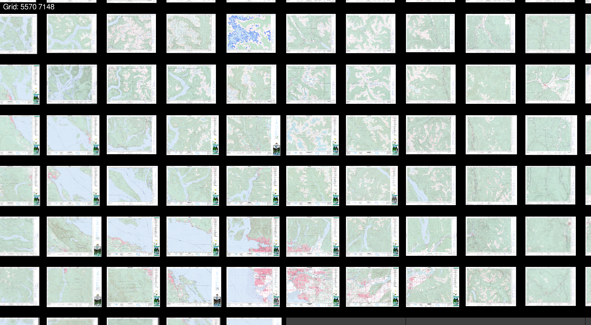

.pn# About imagegrid-viewer: An application for viewing large images in a grid.

The application *imagegrid-viewer* is written in C++ for viewing large
images in a grid.  It was inspired from wanting an application for
displaying freely available Government of Canada NTS (national
topographic system) maps, but one that has a similar feel as to when I
used to pull maps out of the university map cabinet and lay them
side-by-side.

This application is still very much in it's prototyping stage.
However, I have plans to add additional features and fixes, see
[features to be added](#features-to-be-added) for a preliminary list.
I would like *imagegrid-viewer* to end up being a fairly useable
application for viewing large sets of large images that are not just
limited to maps but could include:

- Images such as satellite photos.
- Medical and scientific images.
- Scanned documents such as old books or comic books.
- Any other collection of images or data.

I don't intend *imagegrid-viewer* to replace more specialized
applications such as GIS, but to simply be a way to quickly view large
collections of image-like data.

# Building

Currently *imagegrid-viewer* has only been built on Debian Linux 12
(bookworm).  The dependencies are installed by:

> $ sudo apt-get install libpng-dev libsdl2-dev libtiff-dev libzip-dev

Then run `make` in the *imagegrid-viewer* directory to build.

# Simple Tests

To run some basic unit tests.

> $ make test

To display some tiny images and verify basic functionality see [Manual
Tests](./manual_tests/ManualTests.md).

# Usage

To display a list of sequentially numbered images:

> $ ./imagegrid-viewer -w [width of grid in number of images] -h [height of grid in number of images] [list of images]

To display a list of images:

> $ ./imagegrid-viewer -w [width of grid in number of images] -h [height of grid in number of images] -p [path with sequentially numbered images]

The current key bindings are:

```
arrow keys   move around
-            zoom out
=            zoom in
q            quit
```

A gamepad setup as a joystick for SDL will also move and zoom.
Specifically joystick axis 0/1 moves and joystick axis 4 zooms.

# Some examples and placs to get large images

## View a single large image

A example of a large single image is one of the Antenna Galaxy from
https://esahubble.org/images/heic0602a/ with a download link of:

https://esahubble.org/media/archives/images/original/heic0602a.tif

Put the image `heic0602a.tif` into the same directory as
*imagegrid-viewer* and run the command:

> ./imagegrid-viewer -w 1 -h 1 -l ./heic0602a.tif

## Canadian NTS map collection

An example of viewing a set of 30 NTS maps.

On Debian/Ubuntu distributions if it is not already installed, install
`wget` with the command:

> $ sudo apt-get install wget

Download a set up of NTS topographic maps by running the script
`test-download-canmatrix.sh` in the *imagegrid-viewer* directory with
the command:

> $ ./scripts/test_download_canmatrix.sh

Then run the command:

```
$ ./imagegrid-viewer -f ./scripts/test_download_canmatrix.txt
```

The specific filenames on the NTS ftp site were tested on October
30th, 2023.  They are subject to change due to the versioning of NTS
maps.  These maps represent an area around Vancouver, British
Columbia.

A screenshot of viewing a much larger dataset of almost 4000 1:50K NTS
topographic maps from Vancouver, British Columbia to Winnipeg,
Manitoba in Canada is:  These maps take up 65GB as
compressed TIFF files, and would take up over 500GB uncompressed, but
are viewable comfortably using half the memory of a 16GB machine.
Some of the unreadable maps from the Government of Canada FTP server
can be seen.

A closer look at lower mainland British Columbia is given by:


# Features to be added

## Near future

- Directly use pdf files, or other file formats images are distributed
  in.
- Configuration settings to help work take advantage of either
  available resources or resource limitations
- Break up large images in memory so the textures used are not much
  larger than screen size. NTS topographic maps can be up to about
  10000x8000, which uses up a lot of memory when loaded into a
  texture.  Astronomy images are often much larger than the
  16384x16384 allowed for an individual texture by SDL.
- Have input and/or specification methods for common sources of images
  such as NTS topo maps.
- Add GUI elements to show information or configure while running.

## Further future

- Getting it working on Raspberry Pi class hardware.
- Also build on Windows.
- Display latitude/longitude/UTM or other suitable domain specific
  information.
- Work with non-uniform or overlapping grids of images.
- Plot tracks/trails or other interesting data such as the [Space
  Shuttle SRTM](https://www2.jpl.nasa.gov/srtm/) elevation data.
- Add points that refer to other files and/or metadata.
