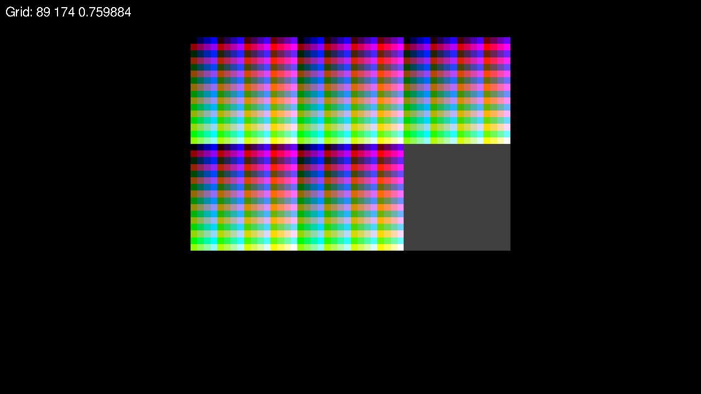
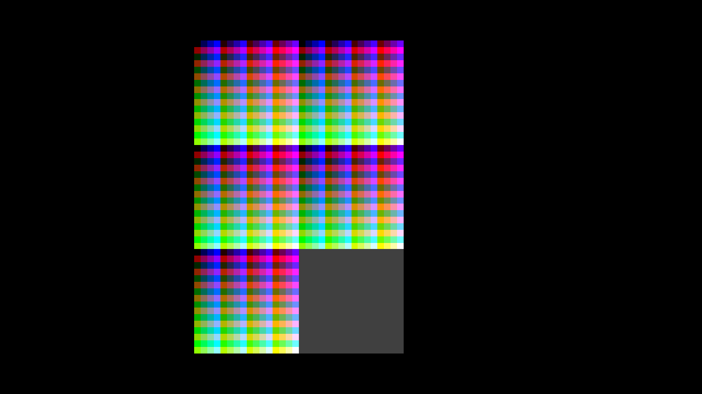

# Manual tests

These are tests that can be run manually to verify functionality
without having to download too many images.

Run the following commands from the project root directory:

> ./imagegrid-viewer -f ./manual_tests/test_small_png.txt

When zoomed in the output should look something like:

> ./imagegrid-viewer -f ./manual_tests/test_small_tif.txt

When zoomed in the output should look something like:

